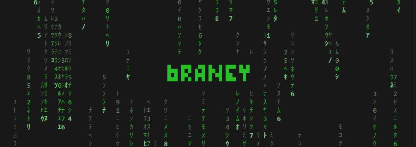
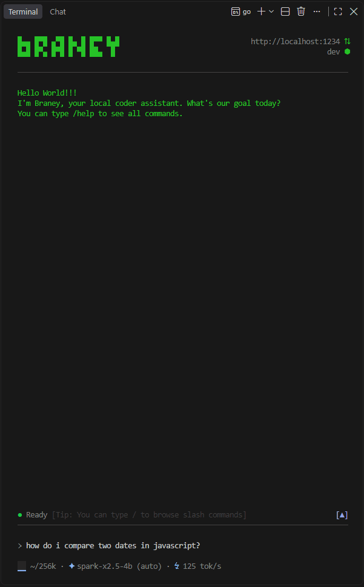
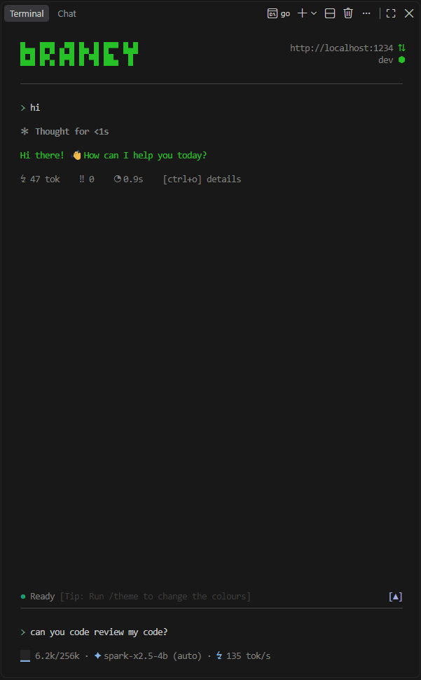

# BRANEY

<p align="center">
  
</p>

**The agent that takes local models seriously.**

Braney is a **batteries included** agent for your terminal, built to get real work out of the model running on
your own hardware. It can read your project, edit files, run code, search the web and check its
own work, with everything it needs already in the box.

## Why Braney

Small models aren't frontier models, and Braney doesn't pretend they are. But they aren't toys
either. A 4B model on a laptop can read code, reason about it and write it. What it can't do is
survive a harness built for a model a hundred times its size.

Most coding agents are made for frontier models. They hand the model a shell, a set of flexible
tools and the full output of everything it runs, and a frontier model copes. A small one quotes a
command wrong, floods its context with a build log, calls a tool almost right, and the session
falls apart. Braney was born from watching that happen.

So Braney goes the other way: **it makes the model more capable by making it more constrained.**

- **Ambiguity is a bug.** Every tool is narrow and hard to call wrong. If a model can misuse one,
  that's Braney's bug to fix, not the model's.
- **Context is scarce.** Big results never flood the conversation; the model pages through them
  when it needs to. Side tasks go to a separate worker that comes back with a paragraph. Long
  conversations compact themselves.
- **Mistakes get caught.** When the model loops, stops halfway, or says it did something it
  didn't, Braney steps in and puts it back on track.

Small models don't need replacing. They need a push, and with one they do a lot.

No magic, though. Braney raises what a model can do, but a better model still does better work.
We validate it on [models from 2B up to 35B parameters](#tested-models), and the bigger ones get
everything here too.

<p>
  
  
  <br clear="both">
</p>

## Install

**macOS and Linux**

```sh
curl -fsSL https://raw.githubusercontent.com/victormga/braney/main/scripts/install.sh | sh
```

**Windows** (PowerShell)

```powershell
irm https://raw.githubusercontent.com/victormga/braney/main/scripts/install.ps1 | iex
```

The [scripts](scripts) check the download against the release's checksums and install Braney
into a folder you own, `~/.local/bin` or `%LOCALAPPDATA%\Programs\Braney`, so it can update
itself there.

**By hand**

Download the archive for your system from
[Releases](https://github.com/victormga/braney/releases/latest) and put `braney` on your `PATH`,
in a folder you own: Braney updates itself in place. On macOS, a browser download is quarantined;
`xattr -d com.apple.quarantine braney` clears it.

## Quick start

1. Start one of the [supported servers](#supported-backends), and load the model with a context
   window of at least 32k tokens. It may run with less, but that isn't tested or recommended.
2. Open a terminal in your project and run `braney`.
3. Pick the server and the model.
4. Ask for something.

`/help` shows the rest.

## What makes it different

### A sandbox instead of a shell

Small models struggle with shells. Bash on Linux mostly works, then come PowerShell and cmd,
different quoting rules, different flags on every OS, programs that aren't installed, sandboxes
that only half work. Each one is another way for a small model to fail.

So by default, the agent gets no shell. It gets a sandboxed JavaScript engine instead, with Node's
APIs and the npm packages it asks for, installed once you approve them. That trade wins twice:

- **It's safer.** The engine is sealed to your project folder. There's no shell running as you
  for the model to get loose in.
- **It's stronger.** Models learn to code mostly from code, and JavaScript is the most common
  language there is. A small model writes a loop over files far more reliably than it chains
  `find | xargs | sed`, and it handles real logic in a way a one-line command never will.

### Safe to leave alone

Braney asks before the agent changes anything, and since the agent can't reach outside the
project folder, yolo mode can stop asking whenever the project is in git. Only what you plug in
yourself, a shell, approved commands or MCP servers, reaches further.

### Each model at its best

Publishers tune their models for specific sampling settings, and the wrong ones can send a small
model into endless repetition. Braney looks them up on Hugging Face when you pick a model and
offers them, leaving your server's own settings alone until you choose.

### Nudges

Small models fail in familiar ways: they repeat themselves, stop halfway, or report work as done
that never happened. Braney catches these as the model works and tells it what went wrong, so it
recovers instead of wasting the turn.

### Batteries included

No plugin hunt. Braney ships with what a coding agent needs: file editing, search, git, web
search, browser integration, images, subagents, memories, skills, hooks, MCP, a web server to
preview what you build.

### Onboarding

Whatever you built for another agent, Braney takes in: rules from `AGENTS.md`, `CLAUDE.md` and
the like, skills from disk, the web or GitHub, the project's own test and lint commands, and your
`mcpServers` config as it is. It asks before approving a command or importing a skill.

### The workshop

Customizing an agent shouldn't mean learning its formats. In the workshop, a separate
conversation about the agent itself, you say what you want it to do differently, and it works out
whether that's a hook, a skill, an instruction, an approved command or a memory, and builds it
with you. Nothing is saved until you've read it and said yes.

### One file per project

Everything Braney keeps about a project, its settings, conversations, memories, skills, hooks and
instructions, lives in a single `.braney` file in the project folder. No markdown rules for an AI
scattered through your repo, mixed in with the code they're about.

One file to keep out of git, and a project's setup can still be exported for your team.

### One binary

Braney is written in Go and ships as a single executable. No Node, no Python, no virtual
environment, no dependency tree pulled onto your machine: the whole program is the file you
downloaded. Go keeps it fast and light, and it runs the same on Windows, macOS and Linux, on x64
and ARM.

## Supported backends

Braney runs on the model backend you already use:

- [LM Studio](https://lmstudio.ai)
- [llama.cpp](https://github.com/ggml-org/llama.cpp)
- [Ollama](https://ollama.com)
- [vLLM](https://github.com/vllm-project/vllm)
- [SGLang](https://github.com/sgl-project/sglang)
- exllama, through [TabbyAPI](https://github.com/theroyallab/tabbyAPI)

Any server with an API compatible with one of these works too: pick the backend it's compatible
with. ninfer, for example, speaks llama.cpp's API, so choosing llama.cpp runs it.

Need another one? [Open a feature request](https://github.com/victormga/braney/issues/new).

**Remote servers are supported**. Point Braney to it using `/configure agent.base_url <url>`

## Tested models

Every model below works cleanly in Braney: no leaked thinking, no broken tool calls. How good the
work is still depends on the model, and grows with its size. All of them were tested with a 32k
context window, the minimum Braney needs.

| Model | Parameters | Quantization | Size |
| --- | --- | --- | --- |
| `minicpm5-2b` | 2B | Q4_K_M | 1.6 GB |
| `qwen3-4b-instruct-2507` | 4B | Q4_K_M | 2.5 GB |
| `nanbeige4.2-3b` | 3B | Q4_K_M | 2.6 GB |
| `spark-x2.5-4b` | 4B | Q4_K_M | 2.6 GB |
| `neohorse-1-4b` | 4B | Q4_K_M | 2.7 GB |
| `qwen3.5-4b` | 4B | UD-Q4_K_XL | 2.9 GB |
| `bonsai-27b` | 27B, 1-bit | Q1_0 | 3.8 GB |
| `gemma-4-e4b` | 4B effective | Q4_K_M | 5.0 GB |
| `qwen3.5-9b` | 9B | Q4_K_M | 5.7 GB |
| `gemma-4-12b` | 12B | Q4_K_M | 7.1 GB |
| `ternary-bonsai-27b` | 27B, ternary | Q2_0 | 7.2 GB |
| `qwen3.8-27b` | 27B | UD-Q4_K_M | 16.5 GB |
| `qwen3.6-27b` | 27B | Q4_K_M | 16.8 GB |
| `thinkingcap-qwen3.6-27b` | 27B | Q4_K_M | 16.8 GB |
| `gemma-4-31b` | 31B | Q4_K_M | 18.3 GB |
| `grug-35b-qat` | 35B | Q4_K_M | 21.2 GB |
| `ornith-1.5-35b` | 35B, 3B active | Q4_K_M | 21.7 GB |
| `qwen3.6-35b` | 35B, 3B active | UD-Q4_K_M | 22.1 GB |

Running one that isn't here, or one that misbehaves?
[Tell us](https://github.com/victormga/braney/issues/new), with the model, its quantization and the
backend.

## What leaves your machine

- Your prompts and code go to the model backend you set, and nowhere else.
- Web searches go to DuckDuckGo, only when the agent searches.
- Anything else the agent's code reaches on the web asks you first, unless you're in yolo mode.
- When you pick a model, Braney looks up its recommended settings on Hugging Face.
- At startup, Braney asks GitHub whether there's a new version.
- Shells, approved commands and MCP servers reach whatever you set them up to reach.

Web search and the update check can both be turned off. No account, no telemetry.

## What's in the box

- Tools shaped for small models: narrow, hard to call wrong, with large results paged instead of
  dumped into the conversation.
- A sandboxed JavaScript engine with Node's APIs and npm packages, where a script's changes land
  all at once or not at all.
- Nudges that catch the model looping, stopping early or claiming work it didn't do.
- Context that looks after itself: conversations compact on their own, and subagents take noisy
  side tasks away.
- The workshop, where hooks, skills, standing instructions, approved commands and memories are
  built by talking.
- Onboarding from what you already have: other agents' rules, the project's commands, skills
  from a file or a URL, another Braney project's setup.
- A yolo mode you can trust, scoped to the project and still guarding what git can't restore.
- One `.braney` binary file per project, instead of rules scattered through your repo.
- Web search, and a headless browser for the pages that need one.
- MCP servers, from the same config every other client uses.
- Sampling tuned to each model, found on its card and remembered per model.

## Documentation

How to use all of it is in the [docs](docs/README.md). Good places to start:

- [Getting started](docs/getting-started.md)
- [The workshop](docs/workshop.md)
- [Hooks](docs/hooks.md)
- [Safety and permissions](docs/safety.md)

## How Braney is built

Braney is made with the help of AI, but it **isn't vibe-coded**. I've been programming for 15
years, and every line of Braney was reviewed, tested and approved by me before it went in.

Codex and Claude Code helped with the safety-heavy parts and the architectural decisions, where a
mistake costs the most. Once the basics worked, Braney was mostly built with Braney, running
Qwen3.8-27B locally.

## Feedback

Braney gets better from real use on real hardware, so tell us what you run into.

- **Found a bug?** [Report it](https://github.com/victormga/braney/issues/new), with the model,
  the backend and your OS. With local models, the same request can go differently from one model
  to the next, and those three are what let us reproduce it.
- **A model keeps getting something wrong?** That's a bug too. If a model can misuse a tool,
  the tool is what should change.
- **Missing something?** [Ask for it](https://github.com/victormga/braney/issues/new): a backend,
  a tool, a nudge for a mistake your model keeps making.

Every issue here gets read.

## Source code

Braney isn't open source, at least not yet. The code is closed for now, and that may change in
the future. Until then, this repository is its home: the releases, the docs, and the issues where
it gets shaped.

The binaries are free for personal and commercial use, under the terms in [LICENSE](LICENSE).
